# **ai-poet-with-`Streamlit`**

> `01_ai-poet-creation.ipynb`를 **`Streamlit`을 사용하여 연결해보기
>  
> • 단계별로 연결하기
>
> > a. `content = 하드코딩 입력` → **`chain.invoke()` 호출**
> >
> > b. `content` = 주제 입력 받기 → **사용자로부터 주제 입력받아 시 생성 함수 호출** → **시 생성**
> >
> > c. **`topic`, `style`, `poet` = 사용자로부터 여러 개의 입력 값(`주제`, `스타일`, `참고 시인`) 받기** → 시 생성 함수 호출 → 시 생성
>
> • 출처
> 
> > LangChain 공식 문서, 조코딩의 랭체인으로 AI 에이전트 서비스 만들기
> >
> > [깃허브 저장소 출처](https://github.com/sw-woo/hanbit-langchain): https://github.com/sw-woo/hanbit-langchain


---

## 1. 구현할 서비스 구조

* **`step_1`**: 
  * 사용자 - 시의 주제 입력 
  * `LLM` - 주제에 맞는 시 생성

* **`step_2`**: 
  * `streamlit` - 프론트엔드 구현해보기

* **`step_3`**: 
  * `LangChain` - 백엔드에서 사용자 입력과 `LLM` 모델의 출력 연결하기

* **`step_4`**: 
  * `LLM` - 선택한 모델의 `API` 호출 → 시 생성하도록 함

---

## **2. `Streamlit`**

### **2.1) `기초`**

* **[`Streamlit`](https://streamlit.io)**

  * `HTML`을 몰라도 **`Python` 코드를 이용해 쉽게 프론트엔트를 구현할 수 있는 라이브러리**

  * 전반적으로 깔끔한 디자인 제공

  * **`Streamlit Community Cloud`** 라는 연게 서비스를 통해 **별도의 비용 없이** 배포 가능

<br>

---

<br>

### **2.2) `설치`**

* [**`공식 사이트`**](http://streamlit.io) - 상단의 [`Docs`] - **`Streamlit 공식 문서`**

  * 좌측 패널: [**`Get Started - Installation`**] 페이지에서 `Streamlit` 라이브러리 설치 방법 확인 가능

  * **`VS Code` 터미널**

```bash
        pip install streamlit
```

  * 설치 완료 후 → 다음 명령어 입력

```bash
        streamlit hello
```

  * 인터넷 브라우저를 통해 데모 웹사이트 열림

    * 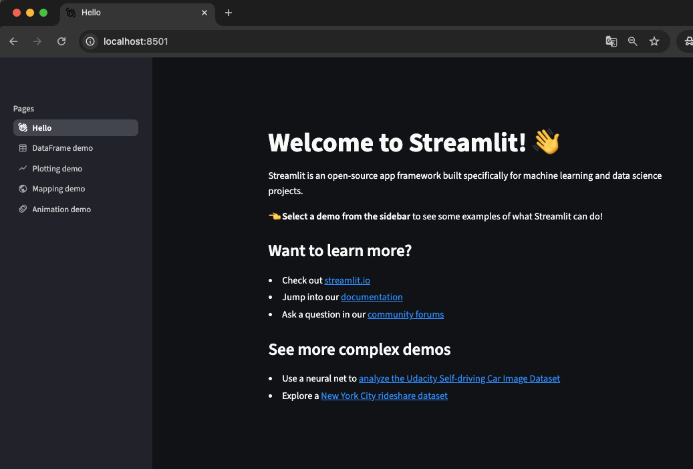

<br>

  * 
    * 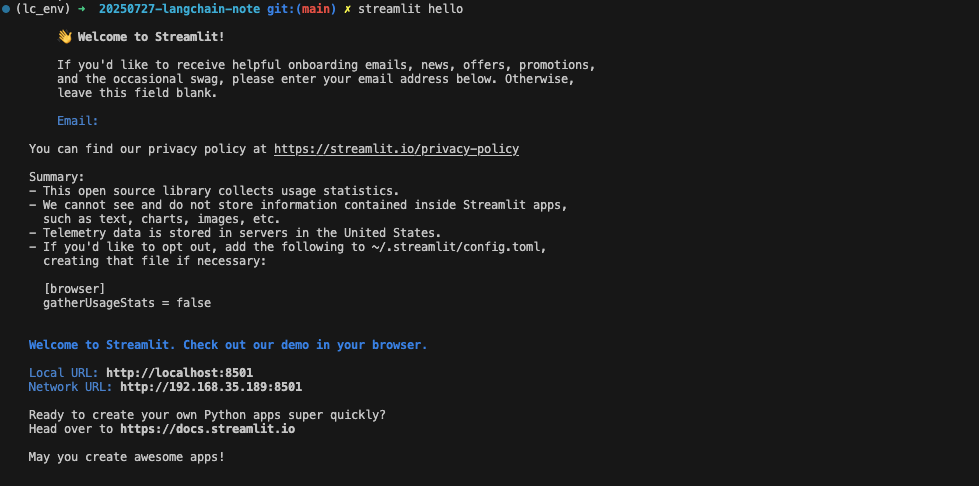

<br>

---

<br>

### **2.3) `사용 방법`**

* **`FE`** 구현에 필요한 화면 구성 요소를 **`Python API`** 형태로 제공

  * *[**`공식 사이트`**](http://streamlit.io) - 상단의 [`Develop`] - [`API Reference`] = `Streamlit` 제공 화면 구성 요소 목록 제공*

  


  * 각 요소 클릭 = `API` 사용법에 대한 상세 가이드 확인 가능
    * `Text elements`, `Data elements`, `Chart elements` 등

    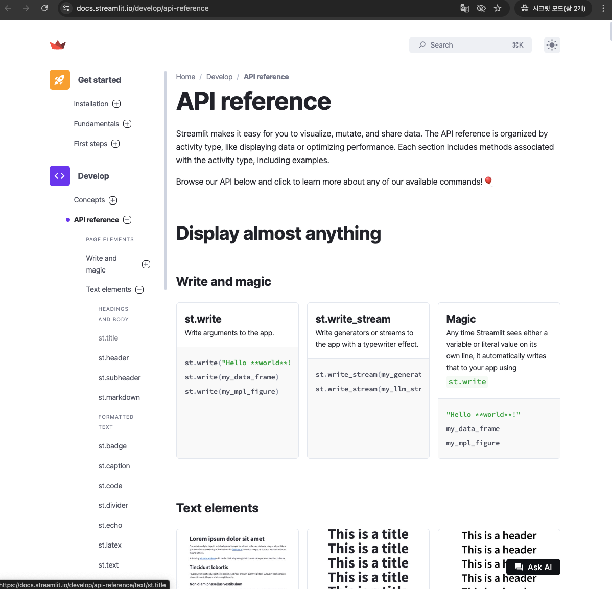

<br>

  * 
    * `Text elements`: **타이틀, 헤더, 캡션, 코드 블록** 등 기본적인 텍스트 요소 + **`Notion`** 등의 문서 작성 툴에서 지원하는 **`md` 문법** 지원

      * `Text elements`

      

<br>

  * 
      * `샘플 코드`
      

<br>

---

<br>

## **3. `VS Code`에 반영해보기** 

> *`py`파일로 실행할 것!*
> > a. `content = 하드코딩 입력` → **`chain.invoke()` 호출**
> >
> > b. `content` = 주제 입력 받기 → **사용자로부터 주제 입력받아 시 생성 함수 호출** → **시 생성**
> >
> > c. **`topic`, `style`, `poet` = 사용자로부터 여러 개의 입력 값(`주제`, `스타일`, `참고 시인`) 받기** → 시 생성 함수 호출 → 시 생성


### 3.1) `content = 하드코딩 입력` → **`chain.invoke()` 호출**

> *`02_ai-poet-with-streamlit.py`*

* 실행 코드
  * *관련 부분만*

```python

    #제목
    st.title("인공지능 시인")

    # content 미리 설정해보기 = "코딩"
    content = "코딩"
    result = chain.invoke({"input": content + "에 대한 시를 써줘"})
    print(result)

    # 출력해보기
    st.title("This is a title")
    st.title("_Streamlit_is :blue[cool] :sunglasses:")

```

* 결과

  * 웹브라우저로 열리는 화면
  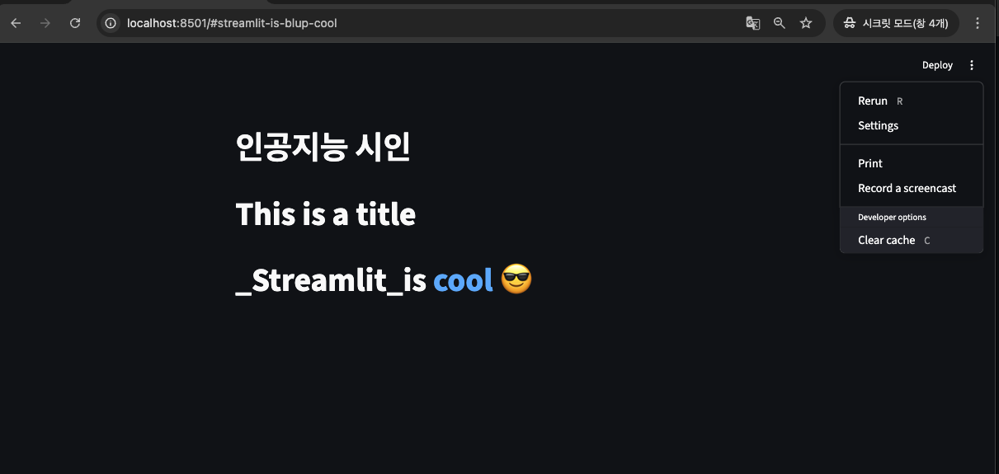

<br>

  * 생성된 시
  
  ```bath
    # bath
    You can now view your Streamlit app in your browser.

    Local URL: http://localhost:8501
    Network URL: http://192.168.35.189:8501
  ```

  ```markdown
    ## 코딩의 노래

    어둠 속에서 빛나는 별처럼,
    알 수 없는 언어들이 춤을 춘다.
    마침표, 쉼표, 괄호의 춤사위,
    논리의 실타래가 엮여 간다.

    화면 가득 펼쳐지는 글자들의 향연,
    하나하나 의미를 품고 속삭인다.
    변수, 함수, 조건문의 마법,
    상상의 세계가 현실로 피어난다.

    때로는 막막한 절벽 앞에 서고,
    오류의 그림자가 드리우지만,
    끈질긴 탐구와 노력의 땀방울,
    마침내 길을 열고 빛을 찾는다.

    새로운 프로그램을 완성하는 기쁨,
    세상을 바꾸는 작은 씨앗을 심듯.
    코딩은 창조의 노래, 무한한 가능성,
    디지털 시대의 시인이 되리.
  ```

  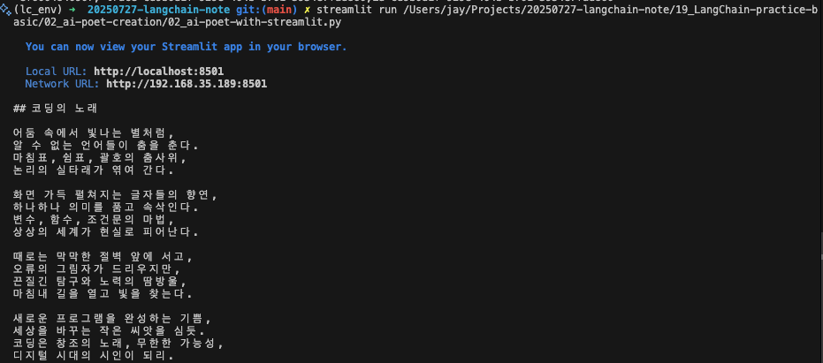

<br>

---

<br>

### 3.2) `content` = 주제 입력 받기 → **사용자로부터 주제 입력받아 시 생성 함수 호출** → **시 생성**

> *`03_ai-poet-with-streamlit.py`*

* 실행 코드
  * *관련 부분만*

```python

    # 1. 제목
    st.title("인공지능 시인")

    # 2. 시 주제 입력 필드
    # st.text_input(입력 필드의 목적을 설명하는 label) = 입력값 → content에 저장
    content = st.text_input("시의 주제를 제시해주세요")

    # st.write() = 화면에 텍스트를 표시하는 함수
    # "시의 주제는" +(더하기 연산자) content 변수값
    st.write("시의 주제는", content)


    # 3. 실행 버튼 설정하기 
    # 시 작성 요청하기 = st.button() = if문을 통해 사용자가 버튼을 눌렀을 때 실행할 동작 명시
    # st.button() → → chain.invoke() = ({"input": content + "에 대한 시를 써줘"})

    if st.button("시 작성 요청하기"):
        with st.spinner('Wait for it...'):                  # 로딩 애니메이션 설정 (with 키워드 아래에 있는 코드 블럭에만 적용)
            result = chain.invoke({"input": content + "에 대한 시를 써줘"})
            st.write(result)

```

* 결과

  * 웹브라우저로 열리는 화면
  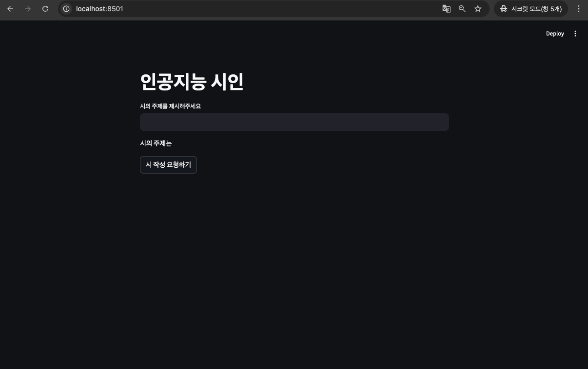

<br>

  * 입력값(`주제`) 넣기
  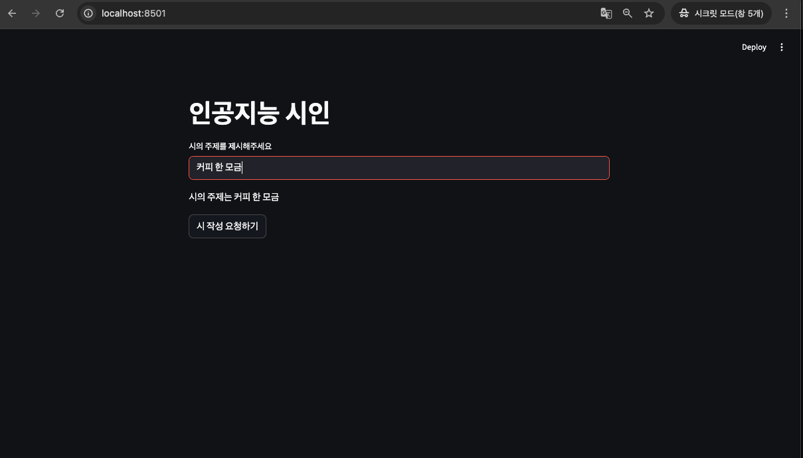

<br>

  * 생성된 시
  
  ```markdown

      ## 커피 한 모금

      아침 햇살 비추는 창가에 앉아 따뜻한 커피 한 모금, 머금는다.

      쌉싸름한 향이 코끝을 간지럽히고 부드러운 온기가 목을 타고 흐른다.

      졸음은 어느새 저 멀리 달아나고 맑고 고요한 시간이 찾아온다.

      오늘 하루도 힘차게 시작할 용기 커피 한 모금에 담겨 온다.

  ```

<br>

  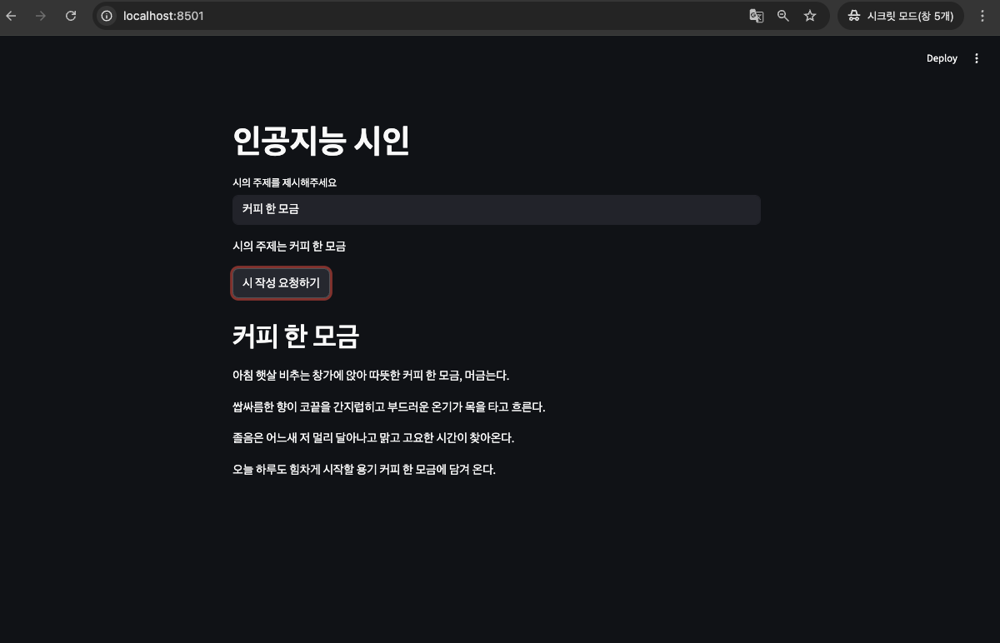


<br>

  * 터미널
  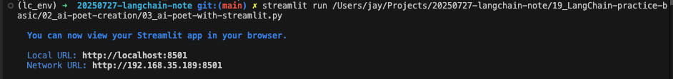

<br>

---

<br>

### 3.3) **`topic`, `style`, `poet` = 사용자로부터 여러 개의 입력 값(`주제`, `스타일`, `참고 시인`) 받기** → 시 생성 함수 호출 → 시 생성

> *`04_ai-poet-with-streamlit.py`*

* 실행 코드
  * *관련 부분만*

```python

    # 1. 제목 및 소개
    #st.title(" 🤖 인공지능 시인 ✒️ ")
    # HTML/CSS를 사용하여 제목과 이모지를 가운데로 정렬해보기
    st.markdown(
        """
        <div style="text-align: center;">
            <h1><span style='font-size: 2.5rem;'>🤖</span> 인공지능 시인 <span style='font-size: 2.5rem;'>✒️</span></h1>
        </div>
        """,
        unsafe_allow_html=True
    )
    st.markdown("<br>", unsafe_allow_html=True)                         # 줄바꿈 추가

    # 2. 입력 필드 (주제, 스타일, 참고 시인)
    # st.write() = 화면에 텍스트를 표시하는 함수
    topic = st.text_input(" • 시의 주제를 입력하세요 : ")
    st.write("시의 주제는 ", topic)
    st.markdown("<br>", unsafe_allow_html=True)                         # 줄바꿈 추가

    style = st.text_input(" • 시의 스타일을 입력하세요 (예: 감성적인, 유머러스한) : ")
    st.write("시의 스타일은 ", style)
    st.markdown("<br>", unsafe_allow_html=True)                         # 줄바꿈 추가

    poet = st.text_input(" • 참고할 시인의 이름을 입력하세요 (예: 김소월, 윤동주) : ")
    st.write("참고할 시인은 ", poet)
    st.markdown("<br>", unsafe_allow_html=True)                         # 줄바꿈 추가


    # 3. 실행 버튼 설정하기

    # st.markdown 함수를 사용하여 버튼 컨테이너에 CSS 스타일 적용
    # st.columns를 사용하여 버튼을 가운데로 정렬합니다.
    col1, col2, col3 = st.columns([1, 1, 1])
    with col2:
        st.markdown(
            """
            <style>
            .stButton > button {
                background-color: #4CAF50;
                color: white;
                font-size: 20px;
                font-weight: bold;
                padding: 10px 24px;
                border: none;
                border-radius: 4px;
                cursor: pointer;
            }
            .stButton > button:hover {
                background-color: #d3d3d3;      /* 호버 효과 색상을 더 진하게 변경 */
            }
            </style>
            """,
            unsafe_allow_html=True
        )

        if st.button(" ✒️__시 작성 요청하기__✒️ "):
            # 입력 필드가 비어있으면 경고 메시지 표시
            if not topic or not style or not poet:
                st.warning(" ⚠️ 모든 항목을 입력해 주세요! ⚠️ ")
            else:
                # 로딩 애니메이션 설정 (with 키워드 아래에 있는 코드 블록에만 적용)
                with st.spinner('⏳ ... Wait for it ... ⏳'):
                    # 체인 실행
                    result = chain.invoke({
                        "topic": topic,
                        "style": style,
                        "poet": poet
                        })
                    time.sleep(5)                                               # 5초 동안 대기
                    st.write(result)

```

* 결과

<br>

  * 처음 버튼 가운데 정렬 실패 화면 
  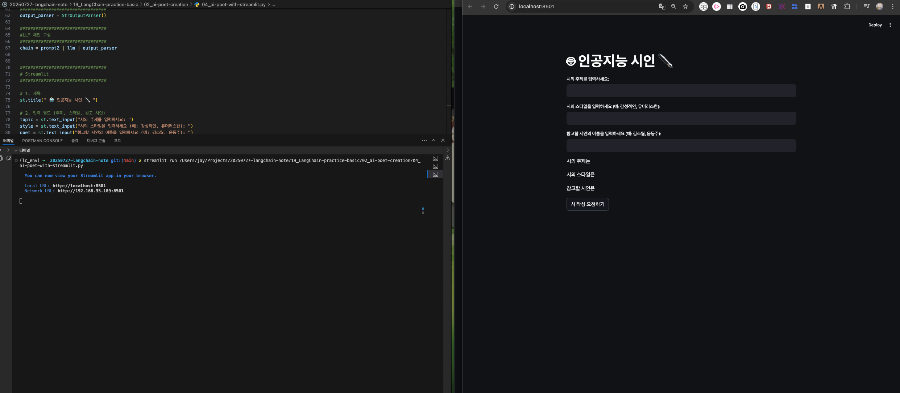

<br>

  * 웹브라우저로 열리는 화면 - **`컬럼을 3열 나눠서 가운데에 버튼을 할당`**
  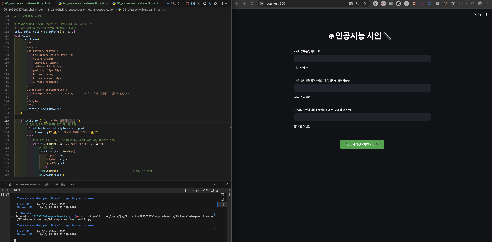

<br>

  * 여러 입력값(`주제`, `스타일`, `참고 시인`) 넣기
  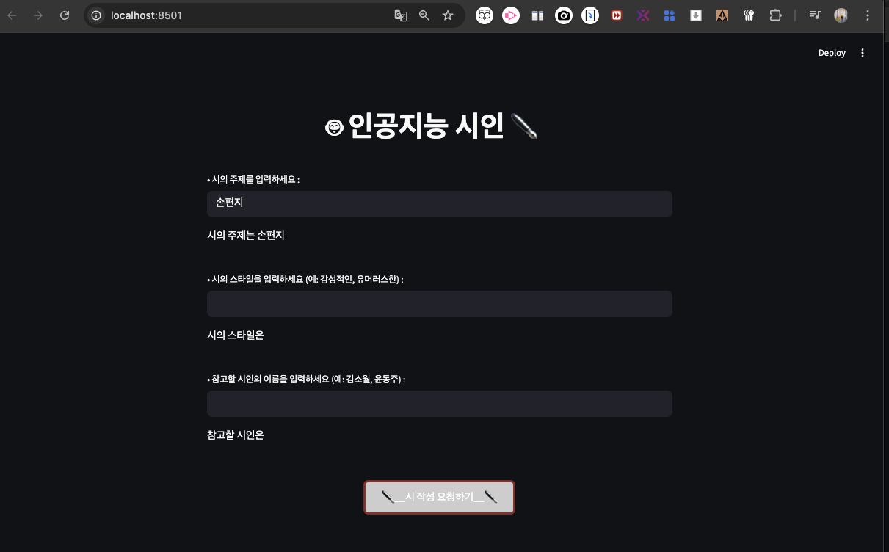

<br>

  * 디버깅 로직 추가
    * 3개 입력값 모두를 충족하지 않을 경우: **경고 메시지**
    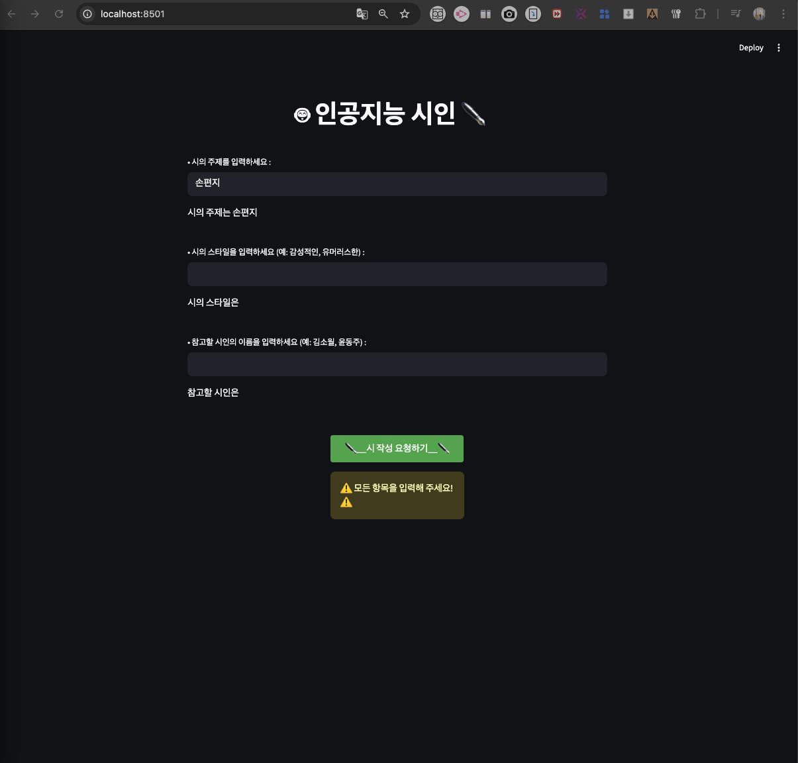

<br>

  * 
    * 3개 모두 충족할 경우에만 입력 버튼 작동 
    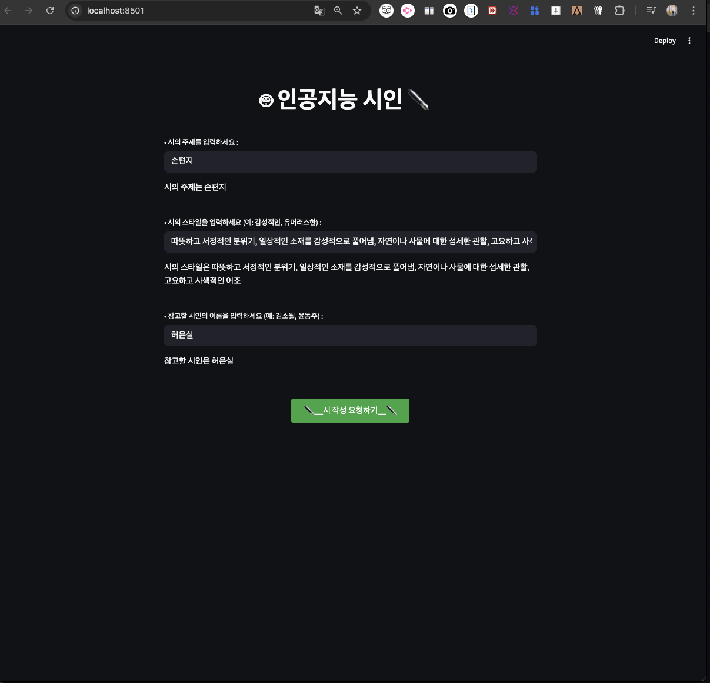

<br>

  * **`CSS`**효과 적용 가능 → 버튼에 `호버` 효과
  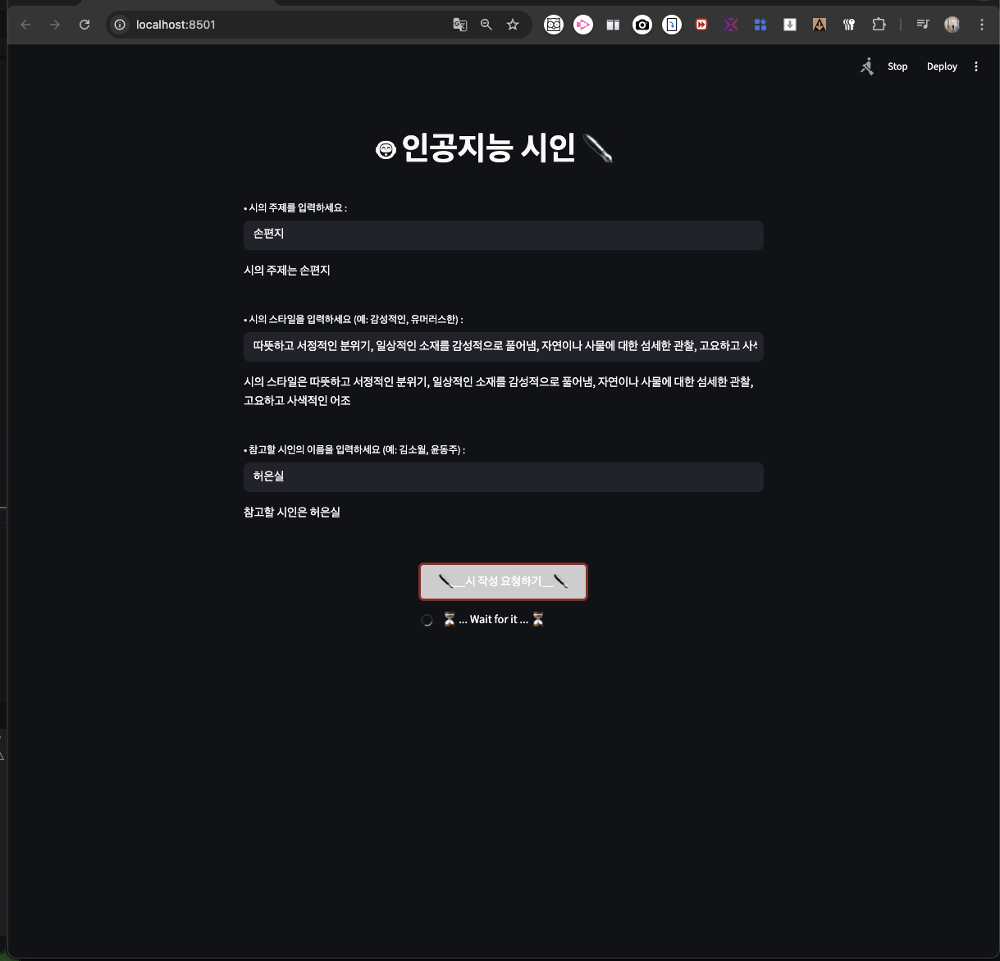

<br>

  * 생성된 시
  
  ```markdown

      ## 낡은 책갈피에 핀 들꽃

        햇살 한 줌, 창가에 내려앉아 먼지 쌓인 책등을 어루만진다. 오랜 세월, 잊힌 이야기들 페이지 사이사이, 숨죽이고 있었지.

        어느 날 문득, 낡은 책갈피에서 작고 여린 들꽃 한 송이 발견했네. 갈색으로 바랜 잎새, 희미한 향기 어느 계절, 누구의 손에 꺾여 이곳에 잠들었을까.

        바람은 문틈으로 스며들어 책장을 조용히 넘기네. 책갈피 속 들꽃은 말없이 그 바람결에 흔들리며 작은 속삭임을 건네는 듯.

        어쩌면 너도, 나처럼 잠시 길을 잃고 헤매다 이곳에 머물렀던 건 아닐까. 세상의 소음에서 벗어나 고요히 자신을 들여다보며 다시 피어날 날을 기다리고 있었던 건 아닐까.

        햇살이 사그라들고 어둠이 창밖을 감싸면 나는 책갈피 속 들꽃을 가만히 그러안고 나만의 고요한 사색에 잠긴다. 우리의 삶도, 이 작은 들꽃처럼 화려하지 않아도, 잊히지 않아도 그 자체로 아름다운 순간들이 있음을.

  ```

<br>

  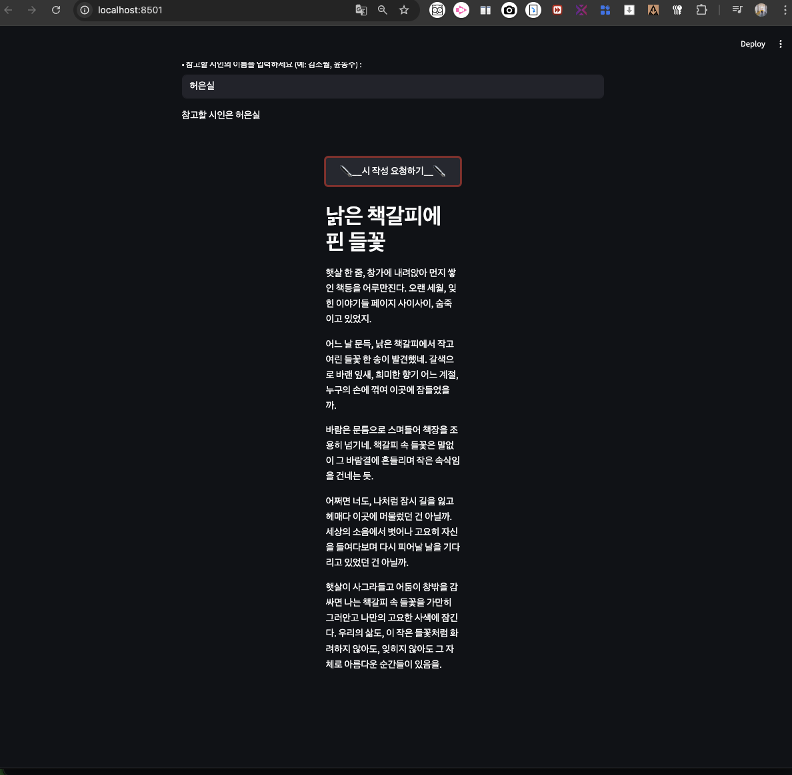

<br>

---

## 4. **`배포`**

> 
> a. 로컬 컴퓨터 작업
> 
> b. **`GitHub Repository`** 업로드
> 
> c. **`Streamlit Community Cloud`** 연결 → 서비스 배포
> 

---