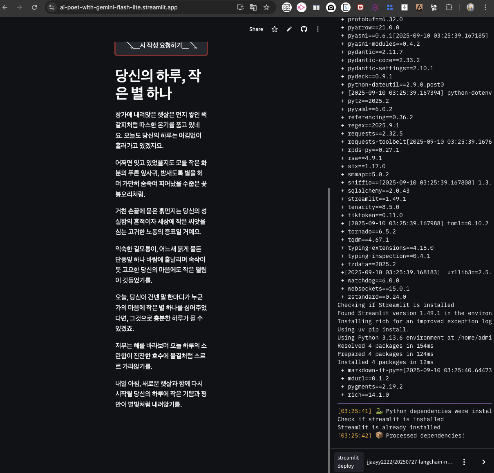

# **01_`streamlit-deployment.md`**

> 📁 위치: /practice/deployment/01_streamlit-deployment.md  
> 
> 📅 정리일: 2025-09-10
> 
> 📱 **`첫 앱배포`**: [**`인공지능 시인`**](https://ai-poet-with-gemini-flash-lite.streamlit.app/#b8c229c2)

---

## 🎯 목적

> 첫 `Streamlit` 앱 배포 **`과정` 및 `결과`** 기록

---

## 🚀 배포

### `Step_1` 배포 화면 
  
* 웹브라우저 설정 = `dark theme`
  


<br>

---

<br>

### `Step_2` 입력 화면
  
* 웹브라우저 설정 = `밝은 화면으로 설정`


  * `밝은 테마` + `호버 효과 확인`

  

<br>

---

<br>

### `Step_3` 생성

* 생성 중 (기본 테마 = `dark theme`)

```markdown

  - 시의 주제: `앱 배포`

  - 시의 스타일: `따뜻하고 서정적인 분위기, 일상적인 소재를 감성적으로 풀어냄, 자연이나 사물에 대한 섬세한 관찰, 고요하고 사색적인 어조` 

  - 참고 시인: `허은실`
  
```

  


<br>

* 생성 결과

```markdown

  ## 당신의 하루, 작은 별 하나

  창가에 내려앉은 햇살은 먼지 쌓인 책갈피처럼 따스한 온기를 품고 있네요. 오늘도 당신의 하루는 어김없이 흘러가고 있겠지요.

  어쩌면 잊고 있었을지도 모를 작은 화분의 푸른 잎사귀, 밤새도록 별을 헤며 가만히 숨죽여 피어났을 수줍은 꽃봉오리처럼.

  거친 손끝에 묻은 흙먼지는 당신의 성실함의 흔적이자 세상에 작은 씨앗을 심는 고귀한 노동의 증표일 거예요.

  익숙한 길모퉁이, 어느새 붉게 물든 단풍잎 하나 바람에 흩날리며 속삭이듯 고요한 당신의 마음에도 작은 떨림이 깃들었기를.

  오늘, 당신이 건넨 말 한마디가 누군가의 마음에 작은 별 하나를 심어주었다면, 그것으로 충분한 하루가 될 수 있겠죠.

  저무는 해를 바라보며 오늘 하루의 소란함이 잔잔한 호수에 물결처럼 스르르 가라앉기를.

  내일 아침, 새로운 햇살과 함께 다시 시작될 당신의 하루에 작은 기쁨과 평안이 별빛처럼 내려앉기를.
  
```

  

---