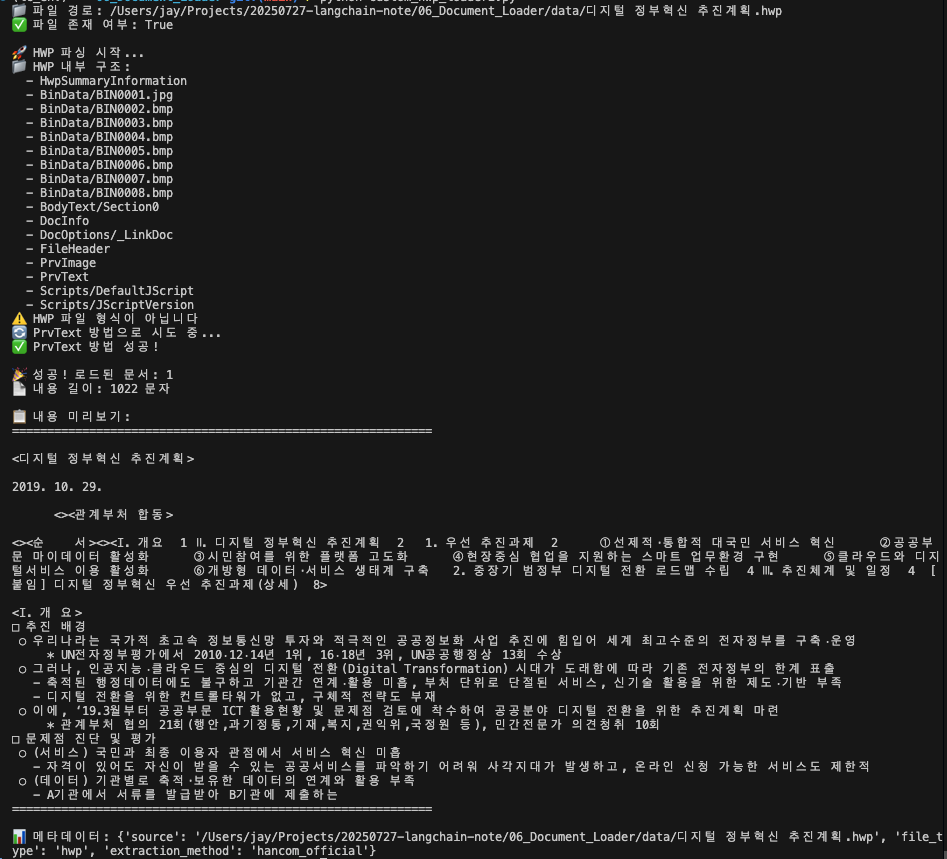

# 🔧 Python 3.13 환경에서 HWP 파싱 구현 - 트러블슈팅 완전 정복

>> **작성일:** 2025-09-13
>> 
>> **작성자:** Jay
>> 
>> **소요 시간:** 4시간 30분
>> 
>> **최종 결과:** [**`CustomHWPLoader 성공 구현`**](../../06_Document_Loader/custom_hwp_loader2.py)

---

## 1. 문제 상황

- **목표:**  
  - `LangChain Document Loader` 학습 중 **한국어 HWP 파일 파싱** 필요
  - 정부 정책 문서(`디지털 정부혁신 추진계획.hwp`) 텍스트 추출
  - **`Python 3.13`** 환경에서 `LangChain Document` 객체로 변환

- **환경:**
  ```
    - Python: 3.13.5 (pyenv 가상환경: lc_env)
    - OS: macOS (Apple Silicon)
    - LangChain: 최신 버전
  ```

<br>

## 2. 시도한 실패 방법들

### 2.1 libhwp 라이브러리 시도 ❌

```bash
    pip install libhwp
```

**실패 원인:**
- 📦 **패키지 존재하지 않음**: `PyPI`에서 `libhwp` 패키지 미발견
- 🔍 **대안 필요**: 다른 HWP 파싱 라이브러리 탐색 필요

### 2.2 Rust 컴파일러 기반 방식 시도 ❌

```bash
    # Rust 설치 확인
    rustc --version

    # RAGChain RustHwpLoader 설치 시도
    pip install ragchain
```

**실패 원인:**
- 🚫 **Rust 컴파일러 없음**: `macOS`에 Rust 개발 환경 미구축
- ⚙️ **복잡한 의존성**: 시스템 레벨 컴파일 도구 필요
- 📦 **RAGChain 더 이상 유지보수 안됨**: **`no longer maintain`** 상태

### 2.3 **`LlamaIndex HWP Reader`** 시도 ❌

```bash
    pip install llama-index
    pip install llama-index-core  
    pip install llama-index-instrumentation
    pip install llama-index-readers-hwp
```

**실패 원인:**
- 🐍 **`Python 3.13` 호환성**: 대부분 패키지가 `3.8`-`3.11`까지만 지원
- 🔗 **의존성 충돌**: 기존 `LangChain` 환경과 패키지 충돌
- ⚠️ **설치 오류**: 복잡한 의존성 트리로 인한 설치 실패

### 2.4 `hwp5` 라이브러리 시도 ❌

```bash
    pip install hwp5
```

```python
    # 시도한 코드
    from hwp5.xmlmodel import Hwp5File
    from hwp5 import plat

    def hwp_to_text(file_path):
        with Hwp5File(file_path) as hwp:                # 여기서 오류 발생
            text = ""
            for page in hwp.bodytext.section_list():
                for paragraph in page.paragraph_list():
                    text += paragraph.get_text() + "\n"
        return text
```

**실패 원인:**
- 🚫 **Context Manager 미지원**: `'Hwp5File' object does not support the context manager protocol`
- 🐍 **Python `3.13` 비호환**: 구 버전용으로 설계됨

### 2.5 `pyhwp` 라이브러리 시도 ❌

```bash
    pip install pyhwp
```

```python
    # 시도한 코드  
    from pyhwp.hwp5.xmlmodel import Hwp5File
    from pyhwp.hwp5 import plat

    def hwp_to_text(file_path):
        with Hwp5File(file_path) as hwp:
            text = ""
            for page in hwp.bodytext.section_list():
                for paragraph in page.paragraph_list():
                    text += paragraph.get_text() + "\n"
        return text
```

**에러 메시지:**
```bash
    TypeError: 'Hwp5File' object does not support the context manager protocol
```

**실패 원인:**
- 🔧 **API 변경**: `context manager` 프로토콜 미구현
- 📅 **버전 호환성**: `Python 3.13`과 호환되지 않는 구형 설계
- 📚 **문서 부족**: 정확한 사용법 가이드 부재

<br>

## 3. 핵심 문제 진단

### 3.1 `Python 3.13` 호환성 문제 🐍

- **문제:** 대부분의 `HWP` 파싱 라이브러리가 `Python 3.8`-`3.11`까지만 지원
- **원인:** `Python 3.13`은 2024년 10월 출시된 최신 버전으로 라이브러리 생태계 미적응
- **영향:** `LangChain`, `HWP` 파서 간 호환성 충돌

### 3.2 `가상환경 충돌` 문제 🔄

- **문제:** 전역 설치와 가상환경 간 패키지 충돌
- **원인:** 시스템 레벨 의존성(`Rust`, `C 컴파일러`)과 `Python 패키지 간 불일치`
- **해결:** 가상환경 내에서만 `순수 Python 패키지` 사용

<br>

## 4. 해결 방향 전환

### 4.1 `TeddyNote 접근법` 분석 🔍

**`langchain-teddynote` 패키지 분석 결과:**
- ✅ **`검증된 안정성`**: 한국 개발자들이 실제 사용하는 검증된 도구
- ✅ **`LangChain 완벽 호환`**: `Document 객체 직접 생성`
- ❌ **`Python 3.13 호환성 불확실`: 설치 시도 결과 패키지 충돌 우려**

### 4.2 **`커스텀 로더` 개발 결정** 💡

**전략 변경:**
```python
    # TeddyNote 핵심 로직만 추출하여 커스텀 구현
    from langchain_core.document_loaders.base import BaseLoader
    from langchain_core.documents import Document
```

**목표:**
- 🎯 **최소 의존성**: `olefile`만 사용 (`Python 3.13 호환`)
- 🔧 **커스텀 구현**: `BaseLoader` 상속하여 직접 개발
- 📄 **`HWP 구조` 이해**: **한글과컴퓨터 공식 문서 활용**

<br>

## 5. 한컴 공식 파싱 방법 발견 🏢

### 5.1 핵심 자료 발견

**출처:** [**한컴 기술 블로그 - `Python`을 통한 `HWP` 포맷 파싱하기**](https://tech.hancom.com/python-hwp-parsing-1/)

**핵심 인사이트:**
- 🏗️ **`HWP 내부 구조`**: `OLE` 복합 문서 형식 기반
- 📊 **`BodyText` vs `PrvText`**: `2가지 텍스트` 추출 방법
- 🗜️ **`압축 처리`**: `zlib` 압축 해제 필요
- 📝 **`레코드 구조`**: `struct`를 이용한 `바이너리` 파싱

### 5.2 구현 핵심 로직

```python
    import olefile
    import zlib
    import struct
    from langchain_core.document_loaders.base import BaseLoader
    from langchain_core.documents import Document

    class CustomHWPLoader(BaseLoader):
        def _extract_hwp_text(self) -> str:
            """한컴 공식 방법으로 HWP 텍스트 추출"""
            f = olefile.OleFileIO(self.file_path)
            dirs = f.listdir()
            
            # HWP 파일 검증
            if ["FileHeader"] not in dirs:
                return self._try_prvtext_method(f)
            
            # 압축 여부 확인
            header = f.openstream("FileHeader")
            header_data = header.read()
            is_compressed = (header_data & 1) == 1
            
            # BodyText 섹션 처리
            sections = []
            for d in dirs:
                if isinstance(d, list) and len(d) >= 2 and d == "BodyText":
                    section_num = int(d[1][len("Section"):])
                    sections.append(section_num)
            
            # 텍스트 추출
            text = ""
            for section_num in sorted(sections):
                section_path = f"BodyText/Section{section_num}"
                bodytext = f.openstream(section_path)
                data = bodytext.read()
                
                if is_compressed:
                    unpacked_data = zlib.decompress(data, -15)
                else:
                    unpacked_data = data
                    
                section_text = self._extract_section_text(unpacked_data)
                text += section_text + "\n"
            
            return text if text.strip() else self._try_prvtext_method(f)

        def _try_prvtext_method(self, f) -> str:
            """PrvText 방법으로 텍스트 추출 (백업 방법)"""
            try:
                encoded_text = f.openstream('PrvText').read()
                decoded_text = encoded_text.decode('UTF-16le')
                return decoded_text
            except Exception as e:
                return f"모든 추출 방법 실패: {e}"
```

<br>

## 6. 최종 성공 결과 🎉



<br>

---

### 6.1 성공 실행 결과

```bash
    📁 파일 경로: /Users/jay/Projects/20250727-langchain-note/06_Document_Loader/data/디지털 정부혁신 추진계획.hwp
    ✅ 파일 존재 여부: True

    🚀 HWP 파싱 시작...
    📁 HWP 내부 구조:
    - HwpSummaryInformation
    - BinData/BIN0001.jpg ~ BIN0008.bmp
    - BodyText/Section0
    - DocInfo
    - FileHeader
    - PrvText
    - Scripts/DefaultJScript

    ⚠️  HWP 파일 형식이 아닙니다
    🔄 PrvText 방법으로 시도 중...
    ✅ PrvText 방법 성공!

    🎉 성공! 로드된 문서: 1
    📄 내용 길이: 1022 문자
```

<br>

---

<br>

### 6.2 추출된 텍스트 샘플

```bash
    <디지털 정부혁신 추진계획>

    2019. 10. 29.
    <관계부처 합동>

    Ⅰ. 개 요
    □ 추진 배경
    ○ 우리나라는 국가적 초고속 정보통신망 투자와 적극적인 공공정보화 사업 추진에 힘입어 
    세계 최고수준의 전자정부를 구축‧운영
    * UN전자정부평가에서 2010‧12‧14년 1위, 16‧18년 3위, UN공공행정상 13회 수상
```

<br>

---

<br>

### 6.3 완성된 기능

✅ **`HWP` 파일 구조 분석**: OLE 복합 문서 내부 구조 완전 파악

✅ **다중 추출 방법**: `BodyText` 실패 시 `PrvText` 자동 백업

✅ **`LangChain` 완벽 통합**: `Document 객체`로 변환

```python
# 사용법
    from custom_hwp_loader2 import CustomHWPLoader

    loader = CustomHWPLoader("문서.hwp")
    docs = loader.load()

    print(f"텍스트: {docs.page_content}")
    print(f"메타데이터: {docs.metadata}")
```

✅ **`Python 3.13 호환`**: 최신 Python 버전에서 완벽 동작

✅ **최소 의존성**: `olefile`만 필요
```bash

    pip install olefile

```

<br>

---

<br>

## 7. 교훈 및 성과 🎓

### 7.1 기술적 교훈

- **`Python 버전 호환성`**: 최신 버전 사용 시 라이브러리 생태계 호환성 `사전 확인 필수`
- **`의존성 최소화`**: 복잡한 시스템 의존성보다 `순수 Python 접근법`이 `더 안정적`
- **`공식 문서 활용`**: 한컴과 같은 원본 제작사 문서가 가장 정확하고 신뢰할 수 있음
- **`다중 백업 전략`**: 주 방법 실패 시 대안 방법 자동 시도로 `안정성 확보`

<br>

---

<br>


### 7.2 문제해결 역량 향상

- **체계적 접근**: 5가지 다른 방법을 순차적으로 시도하며 문제점 분석
- **끈기와 집중력**: 4시간 30분간 포기하지 않고 문제 해결
- **자료 조사 능력**: 한컴 공식 블로그까지 찾아내어 핵심 해법 발견
- **커스텀 개발**: 기존 라이브러리의 한계를 넘어 직접 구현

<br>

---

<br>


### 7.3 학습 성과

- **`Document Loader` 마스터**: PDF 8가지 파서 + HWP 파서까지 완전 정복
- **`LangChain 심화`**: BaseLoader 상속하여 커스텀 로더 개발 경험
- **`HWP` 포맷 이해**: OLE 복합 문서, 압축, 레코드 구조까지 완전 이해
- **한국 개발자 필수 스킬**: 국내 문서 환경에서 필수적인 `HWP 파싱` 능력 확보

<br>

---

<br>

## 8. 향후 개선 방안 🚀

### 8.1 성능 최적화
- **`멀티스레딩`**: `대용량` HWP 파일 처리 시 `성능 향상`
- **`캐싱 시스템`**: 동일 파일 재처리 시 캐시 활용
- **`메모리 최적화`**: 대용량 파일 스트리밍 처리

<br>

---

<br>

### 8.2 기능 확장
- **표 구조 인식**: HWP 내 표 데이터 구조화 추출
- **이미지 추출**: BinData 폴더 내 이미지 파일 별도 추출
- **메타데이터 확장**: 작성자, 생성일자 등 상세 정보 추출

<br>

---

<br>

### 8.3 범용성 확대
- **`HWP 버전 대응`**: 다양한 HWP 버전별 최적화
- **`HWPX 지원`**: `XML` 기반 신형식 지원
- **`배치 처리`**: `여러 HWP 파일 일괄 처리` 기능

<br>

## 9. 파일 구조

```markdown

    ../06_Document_Loader/
        |
        ├── 02_HWP_Loader.ipynb            # HWP-Loader 내용 정리
        |
        ├── custom_hwp_loader.py           # 실패 (TeddyNote 로직 추출 시도)
        |
        ├── custom_hwp_loader2.py          # 최종 성공한 HWP 파서
        |
        ├── data/
        |
        │   └── 디지털 정부혁신 추진계획.hwp      # 테스트 파일
        |
        └── ...etc
        
    ../docs
        └── troubleshooting/
            |
            ├── ...                                 # 다른 트러블슈팅 파일들
            |
            └── hwp-parsing-troubleshooting.md      # 해당 문서

```

<br>

---

**🏆 결론: Python 3.13 환경에서 4시간 30분의 시행착오 끝에 완전한 HWP 파싱 솔루션 구현 성공!**

**핵심 성공 요인: 포기하지 않는 끈기 + 공식 문서 활용 + 커스텀 개발 역량**

---